# Guia de Componentes NL Base React

Aqui veremos os componentes existentes que são usados dentro das telas do NL Base React

## Atalhos:

-   [NlGridLayout](#nlgridlayout)
-   [NlHeader](#nlheader)
-   [NlFormLayout e NlListLayout](#nlformlayout-e-nllistlayout)
-   [NlLabel](#nllabel)
-   [NlLov](#nllov)
-   [NlPaginatedLov](#nlpaginatedlov)
-   [NlPageTitle](#nlpagetitle)
-   [NlSearchSidebar](#nlsearchsidebar)
-   [NlCrudBarFooter](#nlcrudbarfooter)
-   [NlButtons](#nlbuttons)
    -   [NlDeleteButton](#nldeletebutton)
    -   [NlFormSaveButton](#nlformsavebutton)
    -   [NlGoBackButton](#nlgobackbutton)
    -   [NlNewEntityButton](#nlnewentitybutton)
    -   [NlSearchButton](#nlsearchbutton)

# NlGridLayout

Componente container utilizado para aplicar a estilização de grid padrão de uma página form.

Utilizado dentro das páginas form e de gavetas de pesquisa dentro das listagens.

## Props:

-   `children?: ReactNode`: Componentes filhos.

## Exemplo:

```tsx
import NlFormLayout from '@shared/components/NlFormLayout';
import NlGridLayout from '@shared/components/NlGridLayout';
import React, { useState } from 'react';

const NlGridLayoutExample: React.FC = () => {
    return (
        <div className="flex w-screen h-screen flex-col p-3">
            <NlGridLayout>
                <div className="flex w-full h-5 bg-red-500" />
                <div className="flex w-full h-5 bg-green-500" />
                <div className="flex w-full h-5 bg-blue-500" />
                <div className="flex w-full h-5 bg-yellow-500" />
            </NlGridLayout>
        </div>
    );
};

export default NlGridLayoutExample;
```

### Resultado:

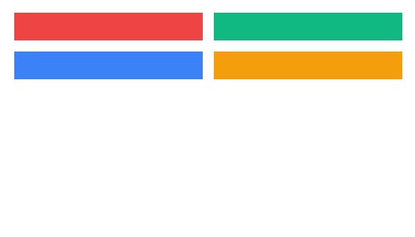

## Exemplo prático:

Tela: FormNlBaseUsuarios.

Podemos ver que o componente NlGridLayout é usado para montarmos a grid de labels/inputs que compõe o form.

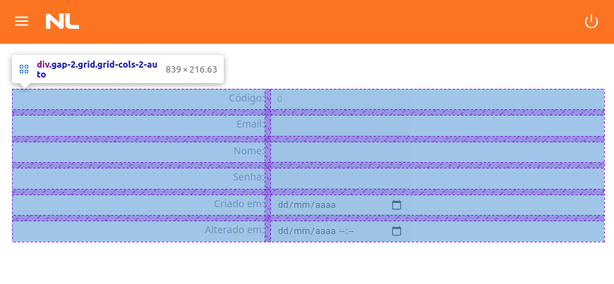

# NlHeader

Componente padrão de cabeçalho do projeto.

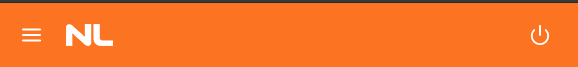

## Props:

O componente NlHeader não recebe nenhuma prop.

# NlFormLayout e NlListLayout

Tanto o NlFormLayout quanto o NlListLayout serve para montar a estrutura básica de uma tela de, respectivamente, form e lista.

Ambos os layouts adicionam como padrão o [NlHeader](#nlheader) e um padding padronizado no resto da página, além de customizações próprias de cada um para a lista e para o form;

## Props:

-   `children?: ReactNode`: Componentes filhos.
-   `isLoading: boolean`: Esta propriedade irá cuidar da animação de loading dentro da aplicação.
-   `title?: string`: Caso informada, irá criar o título padrão dentro do componente.

## Exemplo:

```tsx
import NlFormLayout from '@shared/components/NlFormLayout';
import React, { useState } from 'react';

const NlFormLayoutExample: React.FC = () => {
    const [isLoading] = useState(false);

    return <NlFormLayout isLoading={isLoading} title="Nova página" />;
};

export default NlFormLayoutExample;
```

### Resultado:

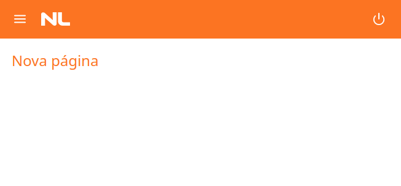

# NlLabel

O NlLabel é um texto com estilizações já feitas para ser usado como labels de campos

## Props:

-   `children?: ReactNode`: Componentes filhos (texto).
-   `...props: React.HTMLAttributes<HTMLSpanElement>`: propriedades passadas para o span.

# NlLov

Componente responsável por executar uma consulta e exibir para o usuário o resultado disponibilizando para que seja possível selecionar um registro. Utilizado principalmente para preencher os campos que possuem relacionamento (FK-foreign key).

## Props

-   `getData: () => Promise<any[]> | any[]`: Método que retorna um array de objetos quaisquer. Esses objetos construirão o conteúdo da lov. Os objetos deverão ter as keys com os nomes dos respectivos campos.

    Dentro do getData, podemos passar uma função asíncrona que retorna um vetor, ou um vetor diretamente. Normalmente, se é passado um função para que possa ser feito a requisição na API para buscarmos os dados.

-   `onAddOpen?: () => void`: Deve ser usado para fazer com que a lov aceite cadastrar novos registros. Irá adicionar um ícone de "+" no lado esquerdo do input que o usuário pode clicar.

    Dentro da função deve ser passado o que que deve-se executar toda vez que o usuário clicar no botão, como por exemplo: abrir uma dialog, fazer uma requizição à API.

-   `watch?: any`: Uma variável qualquer que irá forçar um reload dos dados através da prop `getData`. Toda vez que `watch` mudar, `getData` será executado

-   `ref?: ILovRef`: Uma ref do React que nos possibilita controlar a lov remotamente. Dentro da ref, temos as seguintes funcionalidades:

    -   `getData: () => Promise<any[]>`: Executa a função de busca de dados (getData) novamente para atualizar os dados quando necessário. Retorna o conteúdo buscado.

    <br>

-   `field?: ControllerRenderProps<any, FieldPath<any>>`: Variável field que provém do React-Hook-Form para controlar o valor do componente.

-   `error?: boolean`: Seta o estado de error da lov. Isso altera a estilização para a cor normal do tema para a coloração vermelha de erro.

-   `helperText?: string`: Seta a mensagem para ser posta abaixo da lov. Utilizado frequentemente em conjunto com a propriedade error para colocar a mensagem de erro do yup no componente.

-   `width?: number`: Comprimento personalizado para a lov.

-   `...props: Partial<AutocompleteProps<TextFieldProps, true, true, true>>`: A lov extende todas as propriedades vindas do Autocomplete do Material UI.

## Ex.1: Vamos passar o seguinte array para o getData da lov:

```ts
[
    { codUnidade: 1, desUnidade: 'Unidade 1' }
    { codUnidade: 2, desUnidade: 'Unidade 2' }
    { codUnidade: 3, desUnidade: 'Unidade 3' }
    { codUnidade: 4, desUnidade: 'Unidade 4' }
    { codUnidade: 5, desUnidade: 'Unidade 5' }
]
```

### Resultado:

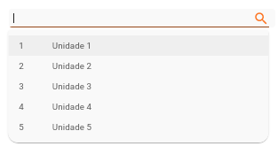

## Ex.2: Exemplo completo usando requizições à API.

```tsx
import NlLov from '@shared/components/NlLov';
import axios from 'axios';
import React, { useState } from 'react';

interface IGithubApiResponse {
    name: string;
    [key: string]: any;
}

const NlLovExample: React.FC = () => {
    const [isReposDialog, setIsReposDialog] = useState(false);

    const getRepoLovData = async () => {
        const response = await axios.get<IGithubApiResponse[]>('https://api.github.com/repos/facebook/react/contents');

        return response.data.map(file => ({
            fileName: file.name,
        }));
    };

    return (
        <div className="p-5">
            <NlLov
                getData={getRepoLovData}
                width={350}
                helperText="Arquivos do repositório"
                onAddOpen={() => setIsReposDialog(true)}
            />
        </div>
    );
};

export default NlLovExample;
```

### Resultado:

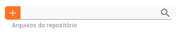

<div></div>

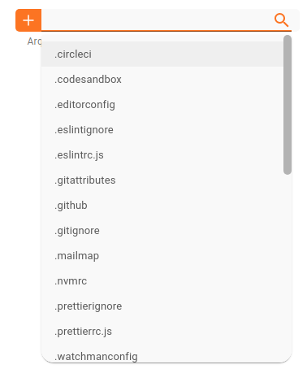

# NlPaginatedLov

Componente de pesquisa que nem a o componente [NlLov](#nllov). Porém tem um comportamento de paginação. Serve para todos os casos onde uma lov retorna muitos itens. Se usarmos uma lov normal, teremos quedas de performance no site inteiro, e sua listagem será toda travada. Resumindo, caso usarmos uma lov normal, teremos uma péssima UX.

## Props

O componente NlPaginatedLov possui as mesmas props de [NlLov](#nllov). As únicas diferenças são:

-   `getData: (newValue: string) => Promise<any[]> | any[]`: Método que retorna um array de objetos quaisquer. Esses objetos construirão o conteúdo da lov. Os objetos deverão ter as keys com os nomes dos respectivos campos.

    `newValue` é o valor que foi digitado no campo que deve ser pesquisado através de um request especial paginado.

    Dentro do `getData`, podemos passar uma função asíncrona que retorna um vetor, ou um vetor diretamente. Normalmente, se é passado um função para que possa ser feito a requisição na API para buscarmos os dados.

-   `ref?: IPaginatedLovRef`: Uma ref do React que nos possibilita controlar a lov remotamente. Dentro da ref, temos as seguintes funcionalidades:

    -   `getData: (currentSearch: string) => Promise<any[]>`: Executa a função de busca de dados (getData) novamente para atualizar os dados quando necessário. Recebe o valor digitado pelo usuário em `currentSearch`. Retorna o conteúdo buscado.

    <br>

# NlPageTitle

Componente de texto com estilização já definida para ser usado como tulo de uma página.

## Props:

-   `className?: string`: className opcional caso haja necessidade de adicionar estilizações customizadas.

# NlSearchSidebar

Gaveta usada para adicionar uma barra lateral de pesquisa dentro de uma listagem.

## Props:

-   `open: boolean`: Variável de controle do estado de abertura da gaveta.
    -   `true`: Gaveta está aberta
    -   `false`: Gaveta está fechada
-   `onClose: () => void`: Função a ser executada na hora que uma ação de fechamento da gaveta é disparado. Essa ação irá disparar automaticamente quando o usuário clicar no botão de fechar na gaveta, clicar o botão ESC ou clicar fora da gaveta.
-   `onErase: () => void`: Função a ser executada no momento que o usuário dispara uma ação para limpar os campos.
-   `width?: number`: Comprimento customizado caso haja a necessidade de aumentar o tamanho máximo da barra lateral

## Exemplo:

```tsx
import { Button, TextField } from '@material-ui/core';
import NlSearchButton from '@shared/components/NlButtons/NlSearchButton';
import NlGridLayout from '@shared/components/NlGridLayout';
import NlLabel from '@shared/components/NlLabel';
import NlSearchSidebar from '@shared/components/NlSearchSidebar';
import React, { useState } from 'react';
import { Controller, useForm } from 'react-hook-form';

const defaultValues = {
    codValor: 0,
    desValor: '',
};

const NlSearchSidebarExample: React.FC = () => {
    const [isSearchSidebarOpen, setIsSearchSidebarOpen] = useState(false);

    const { reset, control } = useForm();

    return (
        <div className="p-5">
            <Button variant="contained" onClick={() => setIsSearchSidebarOpen(true)}>
                Abrir
            </Button>

            <NlSearchSidebar
                open={isSearchSidebarOpen}
                onClose={() => setIsSearchSidebarOpen(false)}
                onErase={() => reset(defaultValues)}
            >
                <NlGridLayout>
                    <NlLabel>codValor</NlLabel>
                    <Controller
                        control={control}
                        name="codValor"
                        render={({ field }) => <TextField {...field} color="primary" variant="filled" />}
                    />

                    <NlLabel>desValor</NlLabel>
                    <Controller
                        control={control}
                        name="desValor"
                        render={({ field }) => <TextField {...field} color="primary" variant="filled" />}
                    />
                </NlGridLayout>
                <NlSearchButton onClick={() => setIsSearchSidebarOpen(false)} />
            </NlSearchSidebar>
        </div>
    );
};

export default NlSearchSidebarExample;
```

### Resultado

Fechado:

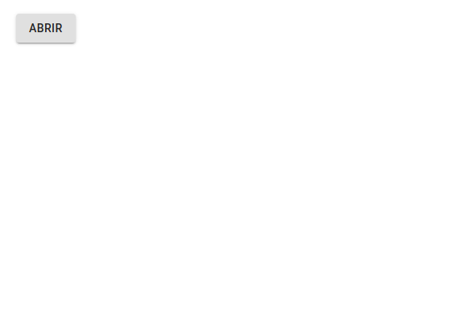

Aberto:

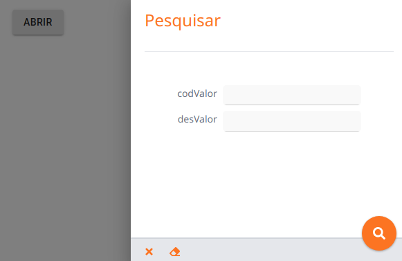

# NlCrudBarFooter

Utilizado dentro das páginas de form para adicionar os botões das ações padrão do form.

## Props

-   `onSaveClick?: () => void`: Ação disparado no momento que o botão de salvar (NlFormSaveButton) é clicado;
-   `onDeleteClick?: () => void`: Ação disparado no momento que o botão de delete (NlDeleteButton) é clicado;
-   `onGoBackClick?: () => void`: Ação disparado no momento que o botão de voltar (NlGoBackButton) é clicado;
-   `disableDelete?: boolean`: Valor booleano que informa se o botão de deletar deve ser desativado ou não.
-   `disableSave?: boolean`: Valor booleano que informa se o botão de salvar deve ser desativado ou não.

## Exemplo:

```tsx
import React from 'react';
import NlCrudBarFooter from '@shared/components/NlButtons/NlCrudBarFooter';

const NlSearchSidebarExample: React.FC = () => {
    return (
        <div className="p-5">
            <NlCrudBarFooter />
        </div>
    );
};

export default NlSearchSidebarExample;
```

## Resultado:

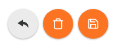

# NlButtons

NlButtons é um diretório dentro do projeto que guarda todas as variantes de botões da NL.

A seguir você verás os vários tipos de botões que existem.

## Props

Todos os seguintes botões estendem as seguintes props:

-   `onClick?: () => void`: Ação executada no clique do botão.
-   `disabled?: boolean`: Valor booleano que ativa ou desativa o botão

# NlDeleteButton

Botão de "Delete".

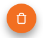

# NlFormSaveButton

Botão de "Salvar".


# NlGoBackButton

Botão de "Voltar".


# NlNewEntityButton

Botão de "Novo".


# NlSearchButton

Botão de "Buscar".


Documentação atualizada em: 06/09/2021
